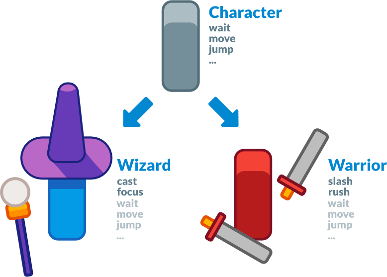

# Scripting

> A "script" in Godot is defined as something that has methods, properties and signals. It also offers a way to use these things (calling methods, get and set properties...).

# Table of Contents

1. [Design Philosophy](#DesignPhilosophy)
    - [Style Guide](#StyleGuide)
    - [VCS](#VCS)
2. [GDScript](#GDScript)
    - [DataTypes](#DataTypes)
        - [String](#String)
    - [Functions](#Functions)
        - [Breakpoints](#Breakpoints)
        - [Warning](#Warning)
    - [Exports](#Exports)
    - [Signals](#Signals)
3. [Source](#Source)

## Design Philosophy

### Object-oriented design and composition

Godot embraces object-oriented design at its core with its flexible scene system and Node hierarchy. It tries to stay away from strict programming patterns to offer an intuitive way to structure your game.

For one, Godot lets you compose or aggregate scenes. It's like nested prefabs: you can create a BlinkingLight scene and a BrokenLantern scene that uses the BlinkingLight. Then, create a city filled with BrokenLanterns. Change the BlinkingLight's color, save, and all the BrokenLanterns in the city will update instantly.

On top of that, you can inherit from any scene.

A Godot scene could be a Weapon, a Character, an Item, a Door, a Level, part of a level… anything you'd like. It works like a class in pure code, except you're free to design it by using the editor, using only the code, or mixing and matching the two.

It's different from prefabs you find in several 3D engines, as you can then inherit from and extend those scenes. You may create a Magician that extends your Character. Modify the Character in the editor and the Magician will update as well. It helps you build your projects so that their structure matches the game's design.

Also note that Godot offers many different types of objects called nodes, each with a specific purpose. Nodes are part of a tree and always inherit from their parents up to the Node class. Although the engine does feature components like collision shapes, they're the exception, not the norm.

### Style Guide

For consistency across projects, we recommend following these guidelines:

- Use snake_case for folder and file names (with the exception of C# scripts). This sidesteps case sensitivity issues that can crop up after exporting a project on Windows. C# scripts are an exception to this rule, as the convention is to name them after the class name which should be in PascalCase.
- Use PascalCase for node names, as this matches built-in node casing.
- In general, keep third-party resources in a top-level addons/ folder, even if they aren't editor plugins. This makes it easier to track which files are third-party. There are some exceptions to this rule; for instance, if you use third-party game assets for a character, it makes more sense to include them within the same folder as the character scenes and scripts.
Try to keep the name of your folder simple here some examples:
    - /models/town/house.
    - /levels/riverdale/riverdale
    - /characters/enemies/goblin

### VCS 
Use Git. That's it.

## GDScript

## Source
- [Godot Docs](https://docs.godotengine.org/en/stable)
- [Why Godot Engine](https://medium.com/rock-milk/why-godot-engine-e0d4736d6eb0)
- [GDNative is here](https://godotengine.org/article/dlscript-here)
- [Godot Engine's vision and development philosophy should be better formalized or easily accessible](https://github.com/godotengine/godot-proposals/issues/575)
<!-- - [Getting Gud at Godot](https://www.alexhoratio.co.uk/2017/05/gitting-gud-at-godot-part-3-scripts.html) -->