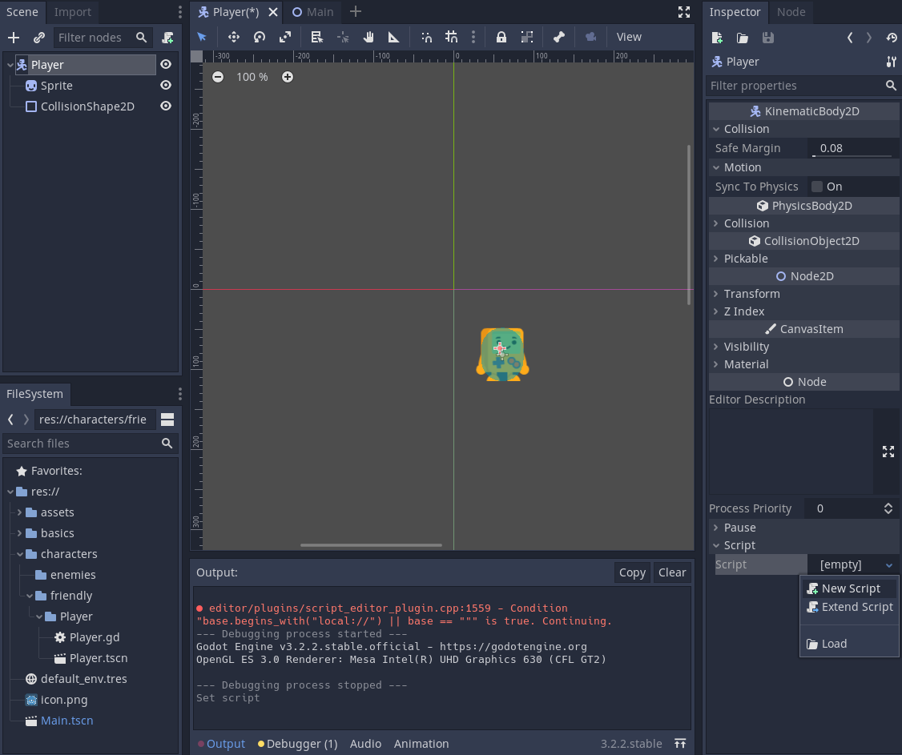

# Scripting

> A "script" in Godot is defined as something that has methods, properties and signals. It also offers a way to use these things (calling methods, get and set properties...).

# Table of Contents

1. [Design Philosophy](#DesignPhilosophy)
    - [Object-oriented design and composition](#)
    - [Style Guide](#)
    - [VCS](#VCS)
    - [Lifecycle](#Lifecycle)
2. [Practice](#Practice)

3. [Source](#Source)

## Design Philosophy

### Object-oriented design and composition

Godot embraces object-oriented design at its core with its flexible scene system and Node hierarchy. It tries to stay away from strict programming patterns to offer an intuitive way to structure your game.

For one, Godot lets you compose or aggregate scenes. It's like nested prefabs: you can create a BlinkingLight scene and a BrokenLantern scene that uses the BlinkingLight. Then, create a city filled with BrokenLanterns. Change the BlinkingLight's color, save, and all the BrokenLanterns in the city will update instantly.

On top of that, you can inherit from any scene.

A Godot scene could be a Weapon, a Character, an Item, a Door, a Level, part of a level… anything you'd like. It works like a class in pure code, except you're free to design it by using the editor, using only the code, or mixing and matching the two.

It's different from prefabs you find in several 3D engines, as you can then inherit from and extend those scenes. You may create a Magician that extends your Character. Modify the Character in the editor and the Magician will update as well. It helps you build your projects so that their structure matches the game's design.


Also note that Godot offers many different types of objects called nodes, each with a specific purpose. Nodes are part of a tree and always inherit from their parents up to the Node class. Although the engine does feature components like collision shapes, they're the exception, not the norm.


### Style Guide

For consistency across projects, we recommend following these guidelines:

- Use snake_case for folder and file names (with the exception of C# scripts). This sidesteps case sensitivity issues that can crop up after exporting a project on Windows. C# scripts are an exception to this rule, as the convention is to name them after the class name which should be in PascalCase.
- Use PascalCase for node names, as this matches built-in node casing.
- In general, keep third-party resources in a top-level addons/folder, even if they aren't editor plugins. This makes it easier to track which files are third-party. There are some exceptions to this rule; for instance, if you use third-party game assets for a character, it makes more sense to include them within the same folder as the character scenes and scripts.
Try to keep the name of your folder simple here some examples:
    - /models/town/house
    - /levels/riverdale/riverdale
    - /characters/enemies/goblin


### VCS
Use Git. That's it.

## Practice
To do some practice now we will make our character move.
Let's take our scene and create a new script.

Be careful to select the Player scene and not the child component.


To keep things more clear let's name our script after our scene, so in this case Player and for the extension we will keep .gd. Click create and that's it.
Now let's take a look at what Godot generated for us: 

```py
extends KinematicBody2D 

# Declare member variables here. Examples:
# var a = 2
# var b = "text"


# Called when the node enters the scene tree for the first time.
func _ready():
	pass # Replace with function body.


# Called every frame. 'delta' is the elapsed time since the previous frame.
#func _process(delta):
#	pass

```
All of it is pretty self explanatory but I'll detail a little more some part to make sure we're on the same page:
```py
extends KinematicBody2D
```
- This bit is saying that our script Player.gd will be able utilize (nearly) all of the properties and functions defined in the class KinematicBody2D
- Node is the base class for all scene objects.
- A tree of nodes is called a scene. (i.e having a CollisionShape2D and a Sprite KinematicBody2D node => Player scene)
```py
# Called when the node enters the scene tree for the first time.
func _ready():
	pass # Replace with function body.
```
- Translated this bit mean: When a Node (see above) enter the Scene Tree (more or less the game loop) for the first time this function will be called. This is what we call Lifecycle but we will get more into it later.
- The Scene Tree manages the game loop via a hierarchy of nodes, so by extension of scenes.


To learn more about the class KinematicBody2D Godot has a great documentation, you just have to CTRL + click on it to open a new tab with all their is to know about this class.
**USE IT IF YOU HAVE A DOUBT ABOUT ANYTHING** , you don't need to read the whole documentation but if you want to know if a certain function exist or a concept is describe in the class just open the documentation and CTRL + F away.


So as stated by the doc we have somes options in the class KinematicBody2D for moving our player, for our exemple I'll be using ```move_and_slide```.
If we read what the doc as to say we can see this:

> This method should be used in Node._physics_process() (or in a method called by Node._physics_process()), as it uses the physics step's delta value automatically in calculations. Otherwise, the simulation will run at an incorrect speed

We can get more detail on ```_physics_process()``` if we click on it but the gist of it is that we need to overwrite this function to use move_and_slide in it. So let's do that. but before to give you all the tool to make this yourself we need to make a quick review of how to create control.

Go to Projet > Projet Settings... > Input Map and add the action move_left, move_right you should find them in the list below

Click on the little + then Key and add the key you want to map to that action


Then to use those in your script you only need to do 
```py
Input.is_action_pressed("move_left")
```
which will give you ```true``` or ```false``` if the key is pressed or not.
We will expand more upon controls for our characters in an another chapter.

To do the exercice you'll also need to define the velocity, speed and gravity: 

```py
extends KinematicBody2D

var velocity : Vector2 = Vector2(0, 0) 
var speed : int = 200

func _physics_process(delta):
    # TODO: Make the player move
	pass

```
Now with this you should be able to make a script for the player to move. To test your script you can run your scene here 


Here's how I did it:

```py
extends KinematicBody2D

var velocity : Vector2 = Vector2(0, 0) 
var speed : int = 200
var gravity: int = 800

func _physics_process(delta):
	velocity.x = 0
	if Input.is_action_pressed("move_left"):
		velocity.x -= speed
	if Input.is_action_pressed("move_right"):
		velocity.x += speed
	velocity = move_and_slide(velocity, Vector2.UP)
	# velocity.y += gravity * delta

```


## Source
- [Godot Docs](https://docs.godotengine.org/en/stable)
- [Why Godot Engine](https://medium.com/rock-milk/why-godot-engine-e0d4736d6eb0)
- [GDNative is here](https://godotengine.org/article/dlscript-here)
- [Godot Engine's vision and development philosophy should be better formalized or easily accessible](https://github.com/godotengine/godot-proposals/issues/575)
<!-- - [Getting Gud at Godot](https://www.alexhoratio.co.uk/2017/05/gitting-gud-at-godot-part-3-scripts.html) -->